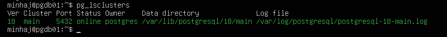
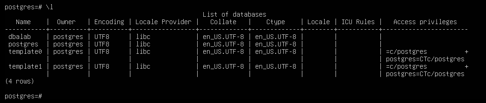

# Lab 001 – PostgreSQL Lab Environment Setup

## Table of Contents

- Lab Information
- Objective
- Environment
- Success Criteria
- Activities Completed
- Commands Practiced
- Skills Practiced
- Lessons Learned
- Screenshots
- Reflection
- Next Lab

## Lab Information

| Item | Value |
|------|-------|
| Lab Number | 001 |
| Lab Name | PostgreSQL Environment Setup |
| Author | Minhaj Ahmed |
| Date | 2026-08-06 |
| Platform | VMware Workstation Pro |
| Virtual Machine | PGDB01 |
| Operating System | Ubuntu Server 26.04 LTS |
| Database | PostgreSQL 18 |
| Status | ✅ Completed |

---

# Objective

Build the first PostgreSQL virtual machine for the Enterprise DBA Lab and verify that PostgreSQL is installed, running, and ready for administration.

---

# Environment

| Component | Details |
|-----------|---------|
| Hypervisor | VMware Workstation Pro |
| Virtual Machine | PGDB01 |
| Operating System | Ubuntu Server 26.04 LTS |
| Memory | 4 GB |
| CPU | 2 vCPU |
| Disk | 40 GB |
| Network | NAT |
| Database | PostgreSQL 18 |

---

# Success Criteria

The lab is considered successful when:

- Ubuntu Server is installed successfully.
- PostgreSQL is installed.
- PostgreSQL cluster status is **Online**.
- Connection to PostgreSQL using `psql` is successful.
- PostgreSQL version is verified.
- A new database (`dbalab`) is created successfully.

---

# Activities Completed

- Created the virtual machine **PGDB01** using VMware Workstation Pro.
- Installed Ubuntu Server 26.04 LTS.
- Updated Ubuntu packages using APT.
- Installed PostgreSQL 18 and PostgreSQL Contrib packages.
- Verified the PostgreSQL cluster status.
- Connected to PostgreSQL using the `psql` command-line interface.
- Verified the PostgreSQL version.
- Created the first PostgreSQL database named **dbalab**.

---

# Commands Practiced

## Update Ubuntu

```bash
sudo apt update
sudo apt upgrade -y
```

## Install PostgreSQL

```bash
sudo apt install postgresql postgresql-contrib -y
```

## Verify PostgreSQL Cluster

```bash
pg_lsclusters
```

## Connect to PostgreSQL

```bash
sudo -u postgres psql
```

## Verify PostgreSQL Version

```sql
SELECT version();
```

## Create Database

```sql
CREATE DATABASE dbalab;
```

---

# Skills Practiced

- VMware virtual machine provisioning
- Ubuntu Server installation
- Linux package management (APT)
- PostgreSQL installation
- PostgreSQL cluster verification
- PostgreSQL administration using `psql`
- Database creation
- Technical documentation

---

# Lessons Learned

- PostgreSQL on Ubuntu is installed using the APT package manager.
- The PostgreSQL cluster can be verified using the `pg_lsclusters` command.
- The `psql` command-line interface is the primary tool for PostgreSQL administration.
- PostgreSQL uses port **5432** by default.
- Proper documentation improves troubleshooting and repeatability.

---

# Screenshots

## Figure 1 – VMware Virtual Machine Configuration


---

## Figure 2 – Ubuntu Server Login


---

## Figure 3 – PostgreSQL Version Verification


---

## Figure 4 – PostgreSQL Cluster Status



---

## Figure 5 – Database Creation



---

# Reflection

This lab established the foundation of my PostgreSQL learning environment. Beyond installing PostgreSQL, I gained hands-on experience with Ubuntu Server, Linux command-line administration, package management using APT, and PostgreSQL verification. This environment will be be used for future labs covering security, backup and recovery, performance tuning, replication, monitoring, automation, and cloud database technologies.

---

# Next Lab

**Lab 002 – PostgreSQL Roles, Users, Databases, and Schemas**

---

**Lab Status:** ✅ Completed

**Repository:** Enterprise DBA Lab

**Author:** Minhaj Ahmed
