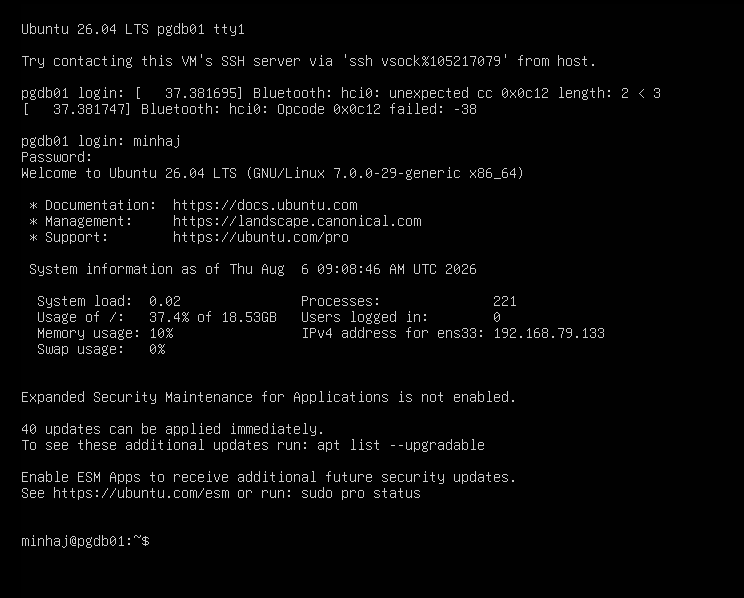
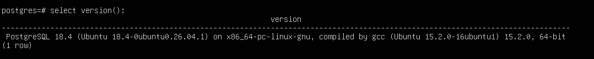

# Lab 001 – PostgreSQL Lab Environment Setup

## Table of Contents

- [Prerequisites](#prerequisites)
- [Lab Information](#lab-information)
- [Objective](#objective)
- [Environment](#environment)
- [Success Criteria](#success-criteria)
- [Procedure](#procedure)
- [Commands Practiced](#commands-practiced)
- [Troubleshooting](#troubleshooting)
- [Skills Practiced](#skills-practiced)
- [Lessons Learned](#lessons-learned)
- [Screenshots](#screenshots)
- [Reflection](#reflection)
- [Outcome](#outcome)
- [Next Lab](#next-lab)
- [Verification Checklist](#verification-checklist)
- [References](#references)
- [Document History](#document-history)

---

## Prerequisites

- VMware Workstation Pro installed
- Ubuntu Server ISO downloaded
- Basic Linux terminal knowledge

---

## Lab Information

| Item | Value |
|------|-------|
| Lab Number | 001 |
| Lab Name | PostgreSQL Environment Setup |
| Author | Minhaj Ahmed |
| Date | 2026-08-06 |
| Platform | VMware Workstation Pro |
| Virtual Machine | PGDB01 |
| Operating System | Ubuntu Server 26.04 LTS |
| Database | PostgreSQL 18 |
| Estimated Duration | 45 minutes |
| Difficulty | Beginner |
| Status | ✅ Completed |

---

## Objective

Build the first PostgreSQL virtual machine for the Enterprise DBA Lab and verify that PostgreSQL is installed, running, and ready for administration.

---

## Environment

| Component | Details |
|-----------|---------|
| Hypervisor | VMware Workstation Pro |
| Virtual Machine | PGDB01 |
| Operating System | Ubuntu Server 26.04 LTS |
| Memory | 4 GB |
| CPU | 2 vCPU |
| Disk | 40 GB |
| Network | NAT |
| Database | PostgreSQL 18 |

---

## Success Criteria

The lab is considered successful when:

- Ubuntu Server is installed successfully.
- PostgreSQL is installed.
- PostgreSQL cluster status is **Online**.
- Connection to PostgreSQL using `psql` is successful.
- PostgreSQL version is verified.
- A new database (`dbalab`) is created successfully.

---

## Procedure

1. Created the virtual machine **PGDB01** using VMware Workstation Pro.
2. Installed Ubuntu Server 26.04 LTS.
3. Updated Ubuntu packages using APT.
4. Installed PostgreSQL 18 and PostgreSQL Contrib packages.
5. Verified the PostgreSQL cluster status.
6. Connected to PostgreSQL using the `psql` command-line interface.
7. Verified the PostgreSQL version.
8. Created the first PostgreSQL database named **dbalab**.

---

## Commands Practiced

### Update Ubuntu

```bash
sudo apt update
sudo apt upgrade -y
```

### Install PostgreSQL

```bash
sudo apt install postgresql postgresql-contrib -y
```

### Verify PostgreSQL Cluster

**Command**

```bash
pg_lsclusters
```

**Sample Output**

```text
Ver Cluster Port Status Owner
18  main    5432 online postgres
```

### Connect to PostgreSQL

```bash
sudo -u postgres psql
```

### Verify PostgreSQL Version

```sql
SELECT version();
```

### Create Database

```sql
CREATE DATABASE dbalab;
```

---

## Troubleshooting

No issues were encountered during this lab. Ubuntu Server and PostgreSQL installed cleanly, and all success criteria were met on the first attempt.

---

## Skills Practiced

- VMware virtual machine provisioning
- Ubuntu Server installation
- Linux package management (APT)
- PostgreSQL installation
- PostgreSQL cluster verification
- PostgreSQL administration using `psql`
- Database creation
- Technical documentation

---

## Lessons Learned

- PostgreSQL uses port **5432** by default.
- Proper documentation improves troubleshooting and repeatability.
- `pg_lsclusters` is a quick way to confirm a PostgreSQL cluster is online before attempting a connection, useful as a first diagnostic step in later labs.

---

## Screenshots

**Figure 1. VMware Workstation Pro virtual machine configuration for PGDB01.**


---

**Figure 2. Ubuntu Server Login**



---

**Figure 3. PostgreSQL Version Verification**



---

**Figure 4. PostgreSQL Cluster Status**


---

**Figure 5. Database Creation**


---

## Reflection

This lab established the foundation of my PostgreSQL learning environment. Beyond installing PostgreSQL, I gained hands-on experience with Ubuntu Server, Linux command-line administration, package management using APT, and PostgreSQL verification. This environment will be used for future labs covering security, backup and recovery, performance tuning, replication, monitoring, automation, and cloud database technologies.

---

## Outcome

The PostgreSQL lab environment was successfully deployed and verified. The server is operational and ready for future exercises involving user management, backup and recovery, security, performance tuning, replication, and automation.

---

## Next Lab

**Lab 002 – PostgreSQL Roles, Users, Databases, and Schemas**

---

**Lab Status:** ✅ Completed
**Repository:** Enterprise DBA Lab

## Verification Checklist

- [x] Ubuntu installed successfully
- [x] PostgreSQL installed
- [x] PostgreSQL cluster online
- [x] Connected using psql
- [x] PostgreSQL version verified
- [x] Database created successfully

---

## References

- PostgreSQL Documentation: <https://www.postgresql.org/docs/>
- Ubuntu Server Documentation: <https://documentation.ubuntu.com/server/>
- VMware Workstation Pro Documentation: <https://techdocs.broadcom.com/>

---

## Document History

| Version | Date | Author | Description |
|---------|------|--------|-------------|
| 1.0 | 2026-08-06 | Minhaj Ahmed | Initial release |
| 1.1 | 2026-08-06 | Minhaj Ahmed | Added troubleshooting section, fixed ToC links and heading structure |

**Author:** Minhaj Ahmed
