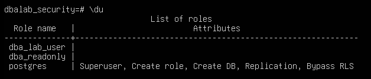
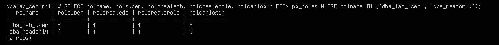
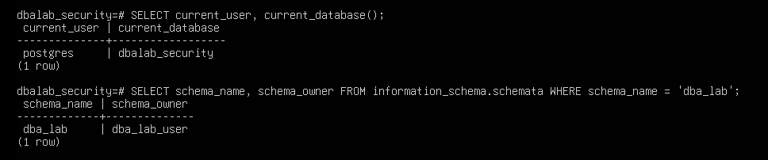
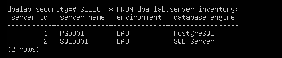
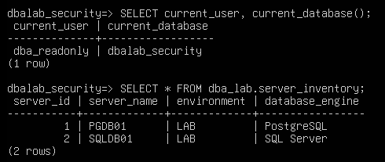
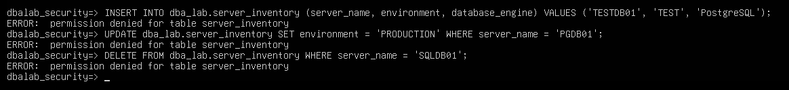

# Lab 002 — PostgreSQL Roles, Database Ownership and Permissions

## Table of Contents

- [Lab Information](#lab-information)
- [Objective](#objective)
- [Environment](#environment)
- [Success Criteria](#success-criteria)
- [PostgreSQL Role Model](#postgresql-role-model)
- [Procedure & Commands Practiced](#procedure--commands-practiced)
- [Troubleshooting](#troubleshooting)
- [Final Permission Matrix](#final-permission-matrix)
- [Final Lab Architecture](#final-lab-architecture)
- [Skills Practiced](#skills-practiced)
- [Lessons Learned](#lessons-learned)
- [SQL Server DBA Perspective](#sql-server-dba-perspective)
- [Screenshots](#screenshots)
- [Reflection](#reflection)
- [Outcome](#outcome)
- [Next Lab](#next-lab)
- [Verification Checklist](#verification-checklist)
- [References](#references)
- [Document History](#document-history)

---

## Lab Information

| Item | Value |
|------|-------|
| Lab Number | 002 |
| Lab Name | PostgreSQL Roles, Database Ownership and Permissions |
| Author | Minhaj Ahmed |
| Date | 2026-08-07 |
| Platform | VMware Workstation Pro |
| Virtual Machine | PGDB01 |
| Operating System | Ubuntu Server 26.04 LTS |
| Database | PostgreSQL 18 |
| Estimated Duration | 90 minutes |
| Difficulty | Intermediate |
| Status | ✅ Completed |

---

## Objective

Understand PostgreSQL role management, database ownership, schema ownership, object permissions, and read-only access — and compare each concept against its SQL Server equivalent.

---

## Environment

| Item | Details |
|------|---------|
| Host | PGDB01 |
| Operating System | Ubuntu Server |
| Database | PostgreSQL |
| PostgreSQL Port | 5432 |
| Administrative Role | postgres |
| Lab Database | dbalab_security |
| Primary Lab Role | dba_lab_user |
| Read-Only Role | dba_readonly |

---

## Success Criteria

The lab is considered successful when:

- A login role is created and verified to have no administrative privileges by default.
- A lab database and schema are created and owned by a non-superuser role.
- A read-only role is created and granted CONNECT, USAGE, and SELECT only.
- INSERT, UPDATE, and DELETE are confirmed to fail for the read-only role.
- Database and schema ownership are verified via system catalogs.

---

## PostgreSQL Role Model

PostgreSQL uses a unified role model. A role can be configured to:

- Log in
- Create databases
- Create other roles
- Become a superuser
- Own databases and database objects
- Receive privileges from other roles

### SQL Server Comparison

| SQL Server | PostgreSQL |
|------------|------------|
| Login | Role with LOGIN |
| Server-level principal | Role |
| `sa` | `postgres` superuser |
| Database user | Role |
| Server permissions | Role attributes |
| GRANT permissions | GRANT permissions |

---

## Procedure & Commands Practiced

### 1. Inspect Existing PostgreSQL Roles

```sql
SELECT rolname, rolsuper, rolcanlogin FROM pg_roles;
```

This displayed the PostgreSQL administrative role, predefined roles (e.g. `pg_checkpoint`), and other system roles.

**Key observation:** not every PostgreSQL role is intended to be used as a login account.

### 2. Inspect the Administrative Role

```sql
SELECT rolname, rolsuper, rolinherit, rolcreaterole, rolcreatedb, rolcanlogin, rolreplication
FROM pg_roles
WHERE rolname = 'postgres';
```

`postgres` is the default administrative superuser created during installation.

### 3. Create a Lab Login Role

```sql
CREATE ROLE dba_lab_user LOGIN PASSWORD 'ChangeMe_2026!';

SELECT rolname, rolsuper, rolcreaterole, rolcreatedb, rolcanlogin
FROM pg_roles
WHERE rolname = 'dba_lab_user';
```

| Attribute | Value |
|-----------|-------|
| LOGIN | Yes |
| SUPERUSER | No |
| CREATEDB | No |
| CREATEROLE | No |

This demonstrates that a PostgreSQL login does not automatically have administrative privileges.

### 4. Test Database Creation Permissions

```sql
CREATE DATABASE testdb;
```

**Result:** `Permission denied` — `dba_lab_user` does not have the `CREATEDB` attribute.

This demonstrates the difference between having permission to log in and having administrative privileges.

### 5. Create the Lab Database

```sql
CREATE DATABASE dbalab_security OWNER dba_lab_user;
```

Ownership was intentionally assigned to `dba_lab_user`:

```text
PostgreSQL
└── dbalab_security
    └── Owner: dba_lab_user
```

### 6. Connect to the Lab Database

```bash
psql -U dba_lab_user -d dbalab_security -h localhost -W
```

```sql
SELECT current_user, current_database();
```

**Expected result:**

```text
current_user     | dba_lab_user
current_database | dbalab_security
```

### 7. Create a Schema

```sql
CREATE SCHEMA dba_lab;

SELECT schema_name FROM information_schema.schemata WHERE schema_name = 'dba_lab';
```

```text
dbalab_security
└── dba_lab
```

### 8. Create a DBA Inventory Table

```sql
CREATE TABLE dba_lab.server_inventory (
    server_id        SERIAL PRIMARY KEY,
    server_name       VARCHAR(100) NOT NULL,
    environment       VARCHAR(50),
    database_engine   VARCHAR(50)
);
```

### 9. Insert Lab Data

```sql
INSERT INTO dba_lab.server_inventory (server_name, environment, database_engine)
VALUES
    ('PGDB01', 'LAB', 'PostgreSQL'),
    ('SQLDB01', 'LAB', 'SQL Server');

SELECT * FROM dba_lab.server_inventory;
```

| server_id | server_name | environment | database_engine |
|-----------|-------------|-------------|------------------|
| 1 | PGDB01 | LAB | PostgreSQL |
| 2 | SQLDB01 | LAB | SQL Server |

### 10. Create a Read-Only Role

```sql
CREATE ROLE dba_readonly LOGIN PASSWORD 'ReadOnly_2026!';

SELECT rolname, rolsuper, rolcreatedb, rolcanlogin
FROM pg_roles
WHERE rolname = 'dba_readonly';
```

| Attribute | Value |
|-----------|-------|
| LOGIN | Yes |
| SUPERUSER | No |
| CREATEDB | No |

### 11. Grant Database, Schema, and Table Access

```sql
-- Allow the role to connect to the database
GRANT CONNECT ON DATABASE dbalab_security TO dba_readonly;

-- Allow the role to access objects within the schema
GRANT USAGE ON SCHEMA dba_lab TO dba_readonly;

-- Grant read-only access to the table
GRANT SELECT ON TABLE dba_lab.server_inventory TO dba_readonly;
```

Resulting permission model:

```text
dba_readonly
│
├── CONNECT → dbalab_security
├── USAGE   → dba_lab schema
└── SELECT  → server_inventory
```

### 12. Test Read-Only Access

```bash
psql -U dba_readonly -d dbalab_security -h localhost -W
```

```sql
SELECT current_user, current_database();
SELECT * FROM dba_lab.server_inventory;
```

The query succeeded and returned both inventory records — confirming read access.

### 13. Test INSERT / UPDATE / DELETE Permissions

```sql
INSERT INTO dba_lab.server_inventory (server_name, environment, database_engine)
VALUES ('TESTDB01', 'TEST', 'PostgreSQL');

UPDATE dba_lab.server_inventory SET environment = 'PRODUCTION' WHERE server_name = 'PGDB01';

DELETE FROM dba_lab.server_inventory WHERE server_name = 'SQLDB01';
```

All three operations were rejected with permission errors, as expected — `dba_readonly` was only granted `SELECT`.

### 14. Inspect Permissions and Roles

```sql
\dp dba_lab.server_inventory
\du
```

`\dp` confirmed `dba_readonly` was granted `SELECT` (`r` in PostgreSQL privilege notation). `\du` confirmed the presence of `postgres`, `dba_lab_user`, and `dba_readonly`.

### 15. Verify Database and Schema Ownership

```sql
SELECT datname, pg_get_userbyid(datdba) AS owner
FROM pg_database
WHERE datname = 'dbalab_security';

SELECT schema_name, schema_owner
FROM information_schema.schemata
WHERE schema_name = 'dba_lab';
```

Both the database and the schema were confirmed to be owned by `dba_lab_user`.

---

## Troubleshooting

| Issue | Cause | Fix |
|-------|-------|-----|
| Querying `information_schema.schemata` for `dba_lab` returned zero rows | Session was connected to the default `postgres` database, not `dbalab_security` — a PostgreSQL schema belongs to a specific database, so it isn't visible from another database context | Ran `\c dbalab_security` to switch database context, then re-ran the query successfully |

**DBA Lesson:** being connected to the PostgreSQL server does not mean objects from every database are visible in the current session. Always verify `current_database()` first when an object appears to be "missing."

```text
PostgreSQL Server
│
├── postgres database
│
└── dbalab_security
    └── dba_lab
        └── server_inventory
```

---

## Final Permission Matrix

| Operation | dba_lab_user | dba_readonly |
|-----------|:---:|:---:|
| LOGIN | Yes | Yes |
| SUPERUSER | No | No |
| CREATEDB | No | No |
| CREATEROLE | No | No |
| Database ownership | Yes | No |
| Schema ownership | Yes | No |
| SELECT | Yes | Yes |
| INSERT | Yes | No |
| UPDATE | Yes | No |
| DELETE | Yes | No |

---

## Final Lab Architecture

```text
PostgreSQL Server
│
├── postgres
│   └── Administrative superuser
│
└── dbalab_security
    │
    ├── Owner: dba_lab_user
    │
    └── dba_lab
        │
        └── server_inventory
            │
            ├── Owner: dba_lab_user
            │
            └── dba_readonly
                └── SELECT only
```

---

## Skills Practiced

- PostgreSQL role administration
- PostgreSQL authentication
- Database ownership
- Schema ownership
- Object ownership
- Role attributes
- GRANT / privilege management
- Read-only access configuration
- Permission testing
- PostgreSQL system catalogs (`pg_roles`, `pg_database`, `information_schema`)
- `psql` administrative commands (`\du`, `\dp`, `\c`)
- Database context troubleshooting
- SQL Server → PostgreSQL concept mapping

---

## Lessons Learned

- PostgreSQL uses roles as its primary security identity model — there is no separate "login" vs. "user" object like SQL Server.
- A role can have LOGIN capability without being a superuser; login and privilege are independent attributes.
- `postgres` is the default administrative superuser, comparable to SQL Server's `sa`.
- Database ownership and object/schema ownership are separate concepts and must each be verified independently.
- Schemas belong to a specific database — a schema created in one database will not appear when connected to another, which caused the troubleshooting issue above.
- `GRANT CONNECT`, `GRANT USAGE`, and `GRANT SELECT` are three distinct, layered permissions — missing any one of them blocks access even if the others are granted.
- Read-only roles should receive only the exact privileges required — this lab's read-only role was correctly blocked from INSERT/UPDATE/DELETE by omission, not by explicit deny.

---

## SQL Server DBA Perspective

| Concept | SQL Server | PostgreSQL |
|---------|-----------|-------------|
| Administrative login | `sa` | `postgres` |
| Login | Login | Role with LOGIN |
| Database user | User | Role |
| Database | Database | Database |
| Schema | Schema | Schema |
| Object ownership | Owner / Principal | Role ownership |
| Read permission | GRANT SELECT | GRANT SELECT |
| Database connection | CONNECT permission | CONNECT |
| System catalog | `sys.*` | `pg_*` catalogs |
| Permission inspection | `sys.database_permissions` | `\dp` / catalog views |

The fundamental security principle is the same across both platforms: **grant only the permissions required to perform the required task.**

---

## Screenshots

**Figure 1. PostgreSQL Roles**



---

**Figure 2. Role Attributes**



---

**Figure 3. Database and Schema Ownership**



---

**Figure 4. Server Inventory Data**



---

**Figure 5. Read-Only SELECT Access**



---

**Figure 6. Read-Only Permission Denied**



---

## Reflection

This lab moved beyond installation into PostgreSQL's core security model. Coming from a SQL Server background, the biggest adjustment was PostgreSQL's unified role model — there's no separate concept of "login" and "user" as distinct object types. Building the permission model layer by layer (CONNECT → USAGE → SELECT) made it clear how PostgreSQL enforces least privilege by requiring every layer to be explicitly granted, rather than relying on a single broad permission.

---

## Outcome

A lab database and schema were successfully created and owned by a dedicated non-superuser role, and a read-only role was configured, tested, and confirmed to have exactly the intended access — no more, no less. The environment is ready for the next lab covering PostgreSQL configuration and authentication.

---

## Next Lab

**Lab 003 – PostgreSQL Configuration & Authentication**

---

**Lab Status:** ✅ Completed
**Repository:** Enterprise DBA Lab

## Verification Checklist

- [x] Login role created and verified to have no administrative privileges
- [x] Lab database created and owned by a non-superuser role
- [x] Schema and table created successfully
- [x] Read-only role created and granted CONNECT, USAGE, SELECT only
- [x] INSERT, UPDATE, DELETE confirmed to fail for the read-only role
- [x] Database and schema ownership verified via system catalogs

---

## References

- PostgreSQL Documentation — Database Roles: <https://www.postgresql.org/docs/current/user-manag.html>
- PostgreSQL Documentation — GRANT: <https://www.postgresql.org/docs/current/sql-grant.html>
- PostgreSQL Documentation — Privileges: <https://www.postgresql.org/docs/current/ddl-priv.html>

---

## Document History

| Version | Date | Author | Description |
|---------|------|--------|-------------|
| 1.0 | 2026-08-07 | Minhaj Ahmed | Initial release |

**Author:** Minhaj Ahmed
