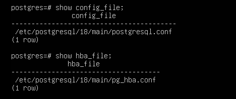
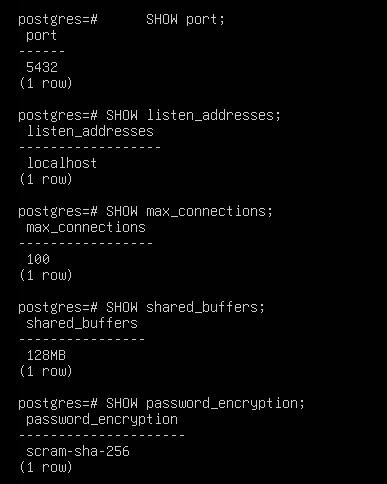
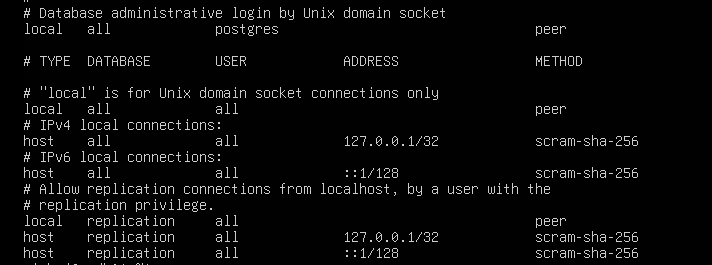
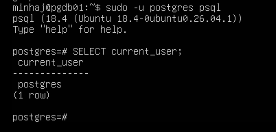
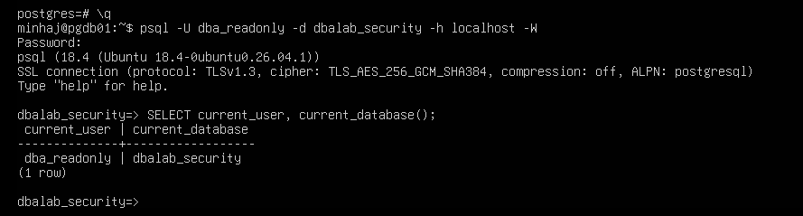
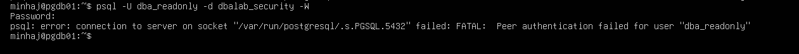
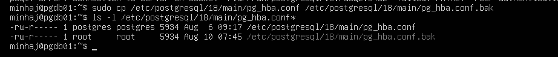
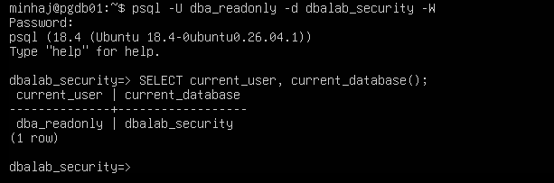
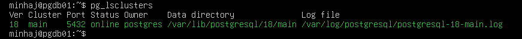
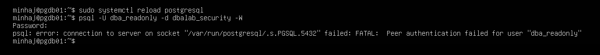

# Lab 003 — PostgreSQL Configuration & Authentication

## Table of Contents

- [Lab Information](#lab-information)
- [Objective](#objective)
- [Procedure & Commands Practiced](#procedure--commands-practiced)
- [Key DBA Concepts Learned](#key-dba-concepts-learned)
- [Commands Used](#commands-used)
- [Screenshots](#screenshots)
- [Final Status](#final-status)
- [Next Lab](#next-lab)

---

## Lab Information

| Item | Value |
|------|-------|
| Lab Number | 003 |
| Lab Name | PostgreSQL Configuration & Authentication |
| Author | Minhaj Ahmed |
| Server | PGDB01 |
| PostgreSQL Version | 18 |
| Operating System | Ubuntu Server 26.04 LTS |
| Date | 2026-08-10 |
| Status | ✅ Completed |

---

## Objective

The objective of this lab was to understand PostgreSQL server configuration and client authentication.

The lab covered:

- PostgreSQL configuration file locations
- `postgresql.conf`
- `pg_hba.conf`
- PostgreSQL configuration parameters
- `peer` authentication
- `scram-sha-256` authentication
- Unix socket vs TCP/IP connections
- Controlled authentication configuration changes
- PostgreSQL configuration reload
- Authentication testing
- Configuration backup and rollback

---

## Procedure & Commands Practiced

### 1. Identify PostgreSQL Configuration Files

Connected to PostgreSQL using:

```bash
sudo -u postgres psql
```

Checked the main configuration file:

```sql
SHOW config_file;
```

```text
/etc/postgresql/18/main/postgresql.conf
```

Checked the client authentication configuration:

```sql
SHOW hba_file;
```

```text
/etc/postgresql/18/main/pg_hba.conf
```

---

### 2. Review PostgreSQL Configuration Parameters

```sql
SHOW port;
SHOW listen_addresses;
SHOW max_connections;
SHOW shared_buffers;
SHOW password_encryption;
```

| Parameter | Value |
|-----------|-------|
| port | 5432 |
| listen_addresses | localhost |
| max_connections | 100 |
| shared_buffers | 128MB |
| password_encryption | scram-sha-256 |

**Observations:**

- PostgreSQL is listening on port 5432.
- `listen_addresses` is set to `localhost`, so PostgreSQL is currently configured to accept TCP/IP connections through the local loopback interface.
- The configured maximum number of connections is 100.
- `shared_buffers` is configured as 128MB.
- Password encryption is configured to use `scram-sha-256`.

---

### 3. Review pg_hba.conf

The active authentication rules were inspected from `/etc/postgresql/18/main/pg_hba.conf`:

```text
local   all          postgres        peer
local   all          all             peer
host    all          all             127.0.0.1/32   scram-sha-256
host    all          all             ::1/128        scram-sha-256
local   replication all             peer
local   replication all             127.0.0.1/32    scram-sha-256
host    replication all             ::1/128         scram-sha-256
```

**Important observation:** PostgreSQL evaluates `pg_hba.conf` rules from top to bottom and uses the first matching rule.

---

### 4. Test Peer Authentication

A local connection was established using:

```bash
sudo -u postgres psql
```

```sql
SELECT current_user;
```

**Result:**

```text
postgres
```

This demonstrated local peer authentication for the PostgreSQL administrative role.

---

### 5. Test SCRAM Authentication

The `dba_readonly` role was tested using a TCP/IP connection:

```bash
psql -U dba_readonly -d dbalab_security -h localhost -W
```

```sql
SELECT current_user, current_database();
```

**Result:**

```text
dba_readonly | dbalab_security
```

The `-h localhost` option forces the connection to use TCP/IP rather than the local Unix socket. This causes PostgreSQL to evaluate the applicable `host` rule, which uses `scram-sha-256` authentication.

---

### 6. Demonstrate Peer Authentication Failure

The same role was tested without specifying `-h localhost`:

```bash
psql -U dba_readonly -d dbalab_security -W
```

The connection failed with a peer authentication error.

The reason: the local connection matched:

```text
local   all   all   peer
```

Peer authentication uses the operating-system user identity. The Linux user was `minhaj`, while the requested PostgreSQL role was `dba_readonly`. Therefore the authentication failed.

---

### 7. Backup pg_hba.conf

Before making a configuration change, a backup was created:

```bash
sudo cp /etc/postgresql/18/main/pg_hba.conf /etc/postgresql/18/main/pg_hba.conf.bak
```

The backup was verified using:

```bash
ls -l /etc/postgresql/18/main/pg_hba.conf*
```

Both the original configuration file and backup file were present.

---

### 8. Controlled Authentication Configuration Change

A temporary rule was added above the general `local all all peer` rule:

```text
local   dbalab_security   dba_readonly   scram-sha-256
```

This rule was designed to allow the `dba_readonly` role to authenticate to the `dbalab_security` database using SCRAM over a local Unix socket.

The configuration was reloaded:

```bash
sudo systemctl reload postgresql
```

The connection was tested without using `-h localhost`:

```bash
psql -U dba_readonly -d dbalab_security -W
```

The connection succeeded. The authenticated user and database were verified:

```sql
SELECT current_user, current_database();
```

**Result:**

```text
dba_readonly | dbalab_security
```

This demonstrated that a more specific `pg_hba.conf` rule placed above the general `local all all peer` rule can override the general authentication behavior for the specified database and role.

---

### 9. Verify PostgreSQL Cluster Status

The PostgreSQL cluster was checked after the configuration reload:

```bash
pg_lsclusters
```

**Result:**

```text
Ver Cluster Port Status Owner    Data directory
18  main    5432 online postgres /var/lib/postgresql/18/main
```

The PostgreSQL 18 main cluster remained online after the configuration reload.

---

### 10. Rollback

The temporary authentication rule was removed from `pg_hba.conf`.

The configuration was reloaded:

```bash
sudo systemctl reload postgresql
```

The connection was tested again without `-h localhost`:

```bash
psql -U dba_readonly -d dbalab_security -W
```

The connection again failed with:

```text
Peer authentication failed for user "dba_readonly"
```

This confirmed that the temporary configuration change had been successfully removed. After the temporary rule was removed and PostgreSQL was reloaded, the original `peer` authentication behavior was restored.

---

## Key DBA Concepts Learned

**Peer Authentication**
`peer` authentication is used for local Unix socket connections and validates the operating-system user identity.

**SCRAM Authentication**
`scram-sha-256` provides password-based authentication for PostgreSQL connections.

**Unix Socket vs TCP/IP**
A connection without `-h` normally uses the local Unix socket. A connection using `-h localhost` uses TCP/IP and can therefore match a `host` rule in `pg_hba.conf`.

**pg_hba.conf Rule Order**
PostgreSQL evaluates authentication rules from top to bottom and uses the first matching rule.

**Reload vs Restart**
A configuration reload can apply authentication configuration changes without taking the PostgreSQL cluster offline.

**Backup and Rollback**
A configuration backup was created before making a controlled change, and the temporary change was removed after testing.

---

## Commands Used

```bash
sudo -u postgres psql
```

```sql
SHOW config_file;
SHOW hba_file;
SHOW port;
SHOW listen_addresses;
SHOW max_connections;
SHOW shared_buffers;
SHOW password_encryption;
SELECT current_user;
SELECT current_user, current_database();
```

```bash
sudo cp /etc/postgresql/18/main/pg_hba.conf /etc/postgresql/18/main/pg_hba.conf.bak
sudo systemctl reload postgresql
pg_lsclusters
```

---

## Screenshots

**Figure 1. PostgreSQL Configuration Files**



---

**Figure 2. PostgreSQL Configuration Parameters**



---

**Figure 3. pg_hba.conf Rules**



---

**Figure 4. Peer Authentication**



---

**Figure 5. SCRAM Authentication**



---

**Figure 6. Peer Authentication Failed**



---

**Figure 7. pg_hba.conf Backup**



---

**Figure 8. Local SCRAM Authentication**



---

**Figure 9. PostgreSQL Cluster After Reload**



---

**Figure 10. Peer Authentication After Rollback**



---

## Final Status

**Lab 003 – PostgreSQL Configuration & Authentication: ✅ Completed**

The PostgreSQL 18 environment was successfully inspected, authentication behavior was tested, a controlled `pg_hba.conf` change was performed, the configuration was reloaded, authentication was verified, and the temporary change was rolled back successfully.

---

## Next Lab

**Lab 004 – PostgreSQL Database & Schema Management**

**Author:** Minhaj Ahmed
